# Setting up Klaviyo Events and Emails

**Note: Klaviyo events and emails are only available on the Personalize Plan and higher**

By default once you sign up for the Personalize Plan you will recieve Klaviyo events. This does require an initial setting up on our end but once configured you should reviece events.

## Viewing Events

After you have been set up and at least one quiz has been taken quiz events should show up in the **Visual Quiz by AskWhai** metric in the **Analytics** section. Clicking into the metric will allow you to view analytics about the event as well as take various actions:

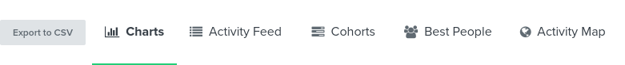

### Event types

By navigating to Best People you should see a list of user profiles. After selecting one it should bring you to the user's profile with a list of all the events they've triggered. Currently we log 3 types of events: Start, Answer, and Complete. Below we have an example of how each should look:

#### Start

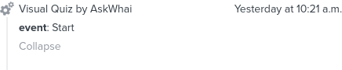

#### Answer

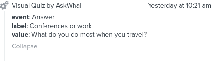

#### Complete

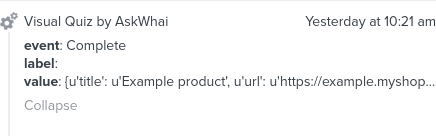

## Sending Emails

**Note: Feel free to ask us about the flow setup as we can quickly set a basic flow on our end if requested**

To send emails after a user completes a quiz we need to create a new flow. You can do this by navigating to Flows > Create Flow. This will bring you to a screen with flow templates, we're going to ignore most of those and click on "Create from Scratch" instead:

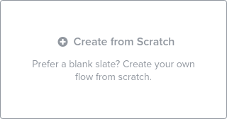

From here you can set a name ("Quiz Takers - AskWhai" is what we're using for this example):

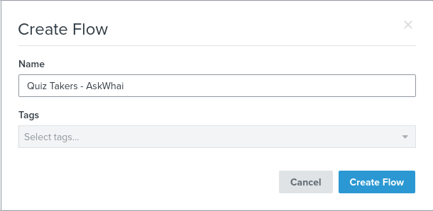

And click on "Create Flow".

### Flow Setup

This will bring you to the empty flow that you just made:

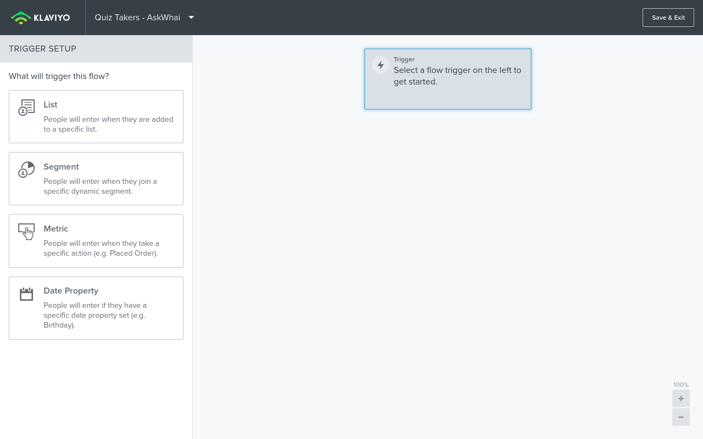

On the left panel click on "Metric" and then from the "Flow Trigger" Dropdown select "Visual Quiz by AskWhai":

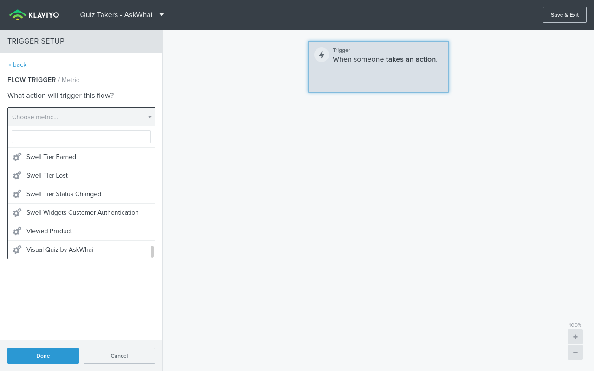

Next click on "Trigger Filters" and "Add a Trigger Filter". This will bring you to the trigger setup:

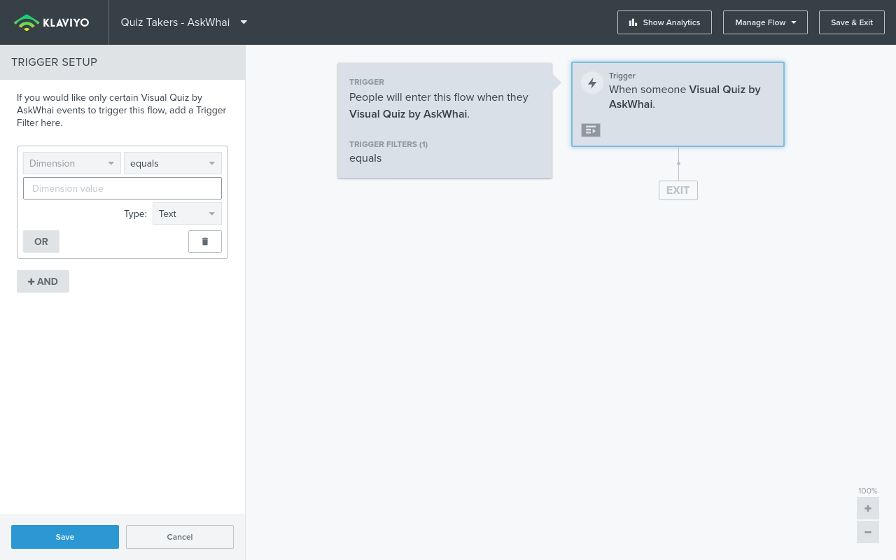

For the "Dimension" dropdown select "event" and in the "Dimension Value" input select "Complete", it should look something like this:

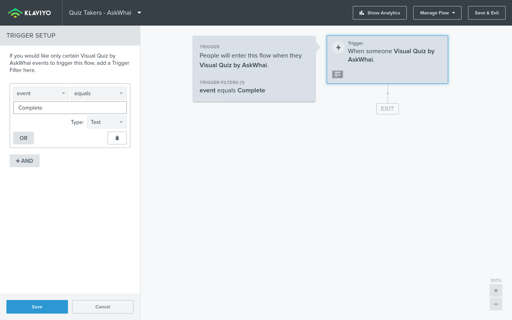

After this click on "Save" and then "Done".

### Creating the Email

Once that is complete drag and drop the "Email" action into the flow:

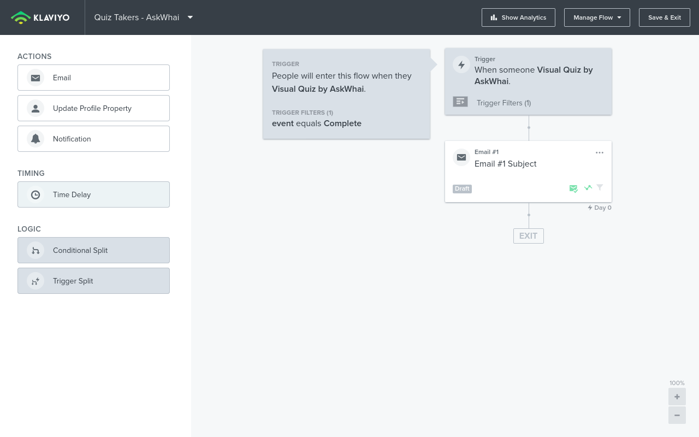

You can then select the email action and click "Configure Content":

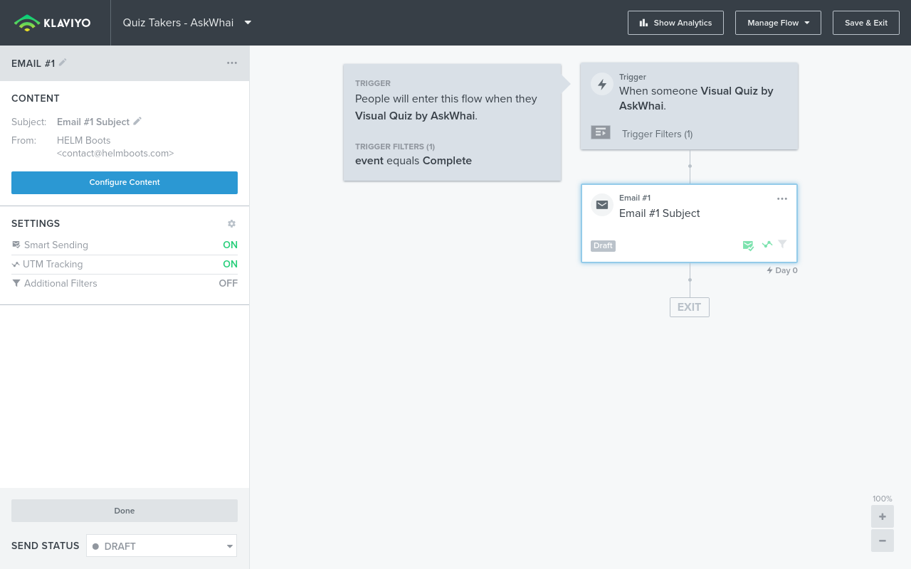

This will bring you to a screen where you can configure the Sender name, Sender email address, Subject, and Preview text:

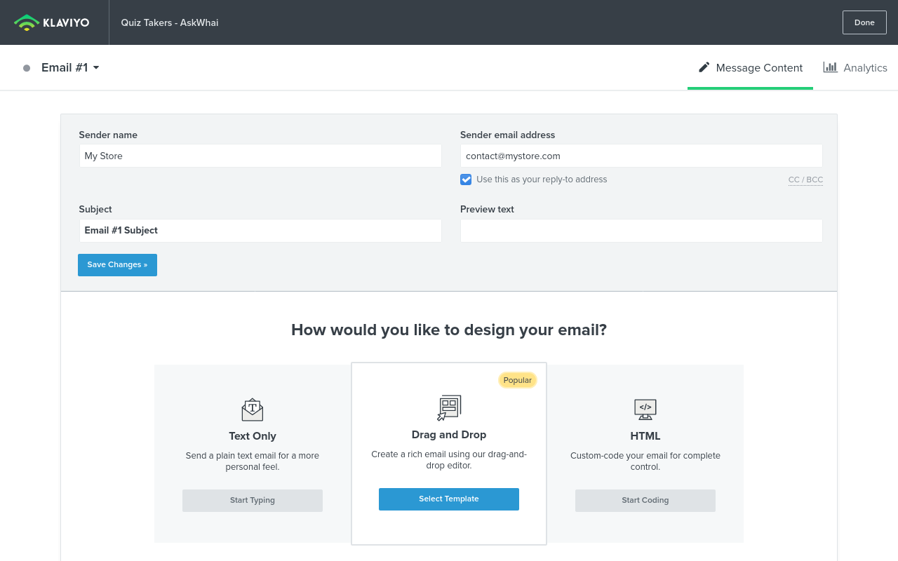

We sugguest that you have a template prepared to use for the recommendation email, if not you can create one or use one of Klaviyo's pre-built templates.

## Setting Up the Product Recommendations

The last step is to add a text block where you want the recommendations to generate, click the "Source" Button, and add this code snippet:

```
<table border="0" cellpadding="0" cellspacing="0" role="presentation" style="min-width: 100px; max-width: 600px;">
	<tbody>
		<tr>
        
			<th bgcolor="#ffffff" class="product" style="font-size:0pt; line-height:0pt; padding:0; padding-bottom: 20px; margin:0; font-weight:normal; display: inline-block; width: 48%; float: left; vertical-align:top;" width="{{ item.width }}%;">
			<table border="0" cellpadding="0" cellspacing="0" width="100%">
				<tbody>
					<tr>
						<td style="font-size:0pt; line-height:0pt; text-align:center; padding-bottom:20px;"></td>
					</tr>
					<tr>
						<td style="color:#000000; font-family:'Raleway', Arial, sans-serif; font-size:20px; line-height:24px; text-align:center; padding-bottom:15px;">{{ item.title }}</td>
					</tr>
					<tr>
						<td align="center">
						<table border="0" cellpadding="0" cellspacing="0" style="text-align:center;  background-color:#000000;border-radius:5px;border-collapse:separate;">
							<tbody>
								<tr>
									<td style="font-family:'Raleway', Arial, sans-serif; font-size:14px; line-height:18px; text-align:center; padding:10px; background:transparent;"><a href="{{ item.url }}" style="color:#fff; text-decoration:none;" target="_blank">Buy Now</a></td>
								</tr>
							</tbody>
						</table>
						</td>
					</tr>
				</tbody>
			</table>
			</th>
			
		</tr>
	</tbody>
</table>
```

Save the template and you should be all set up and good to go! Just make sure you set the flow to "Live" so it takes effect!