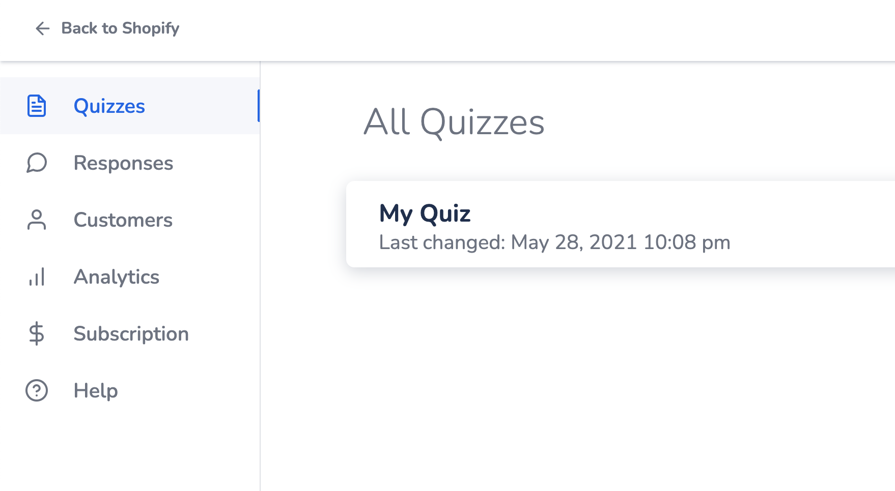

# Setting up Custom Recommendations page with Shopify

The process starts with creating a page template in Shopify Theme editor then creating a page with that template.

The template code would have a javascript code that's responsible for processing the data from the quiz, that data includes recommended products and would contain user information (Email, Name) if available.

## Creating Shopify Page Template

To access the editor page you need to follow these steps:

1. Access your store dashboard

2. From the dashboard sidebar click on **Online Store**


3. In live theme section press on Actions > Edit Code


4. From the Editor sidebar and under **Templates** section, press on **Add a new template**


5. From the creation modal chose the template type as **Page** and enter any name you like for the template and press on **Create Template**


6. The liquid code like any html code is consisted of three parts: (HTML, CSS, JS), we're gonna add them one by one

7. Add the parent element that will contain the products, the most easy way is by looking in the page for a line that reads `{{ page.content }}` and paste this block of code beneath it:
```html
<div id="products"></div>
```
The code should look something like this:


8. Now we would need to add the javascript code for fetching the products, at the end of the page copy and paste the following block of code:

```javascript
<script>
  // Parsing the url paramaters and data and store them in global variable "params"
  var params = window.location.search.substr(1).split('&').reduce(function (q, query) {
    var chunks = query.split('=')
    var key = chunks[0]
    var value = chunks[1]
    return (q[key] = value, q)
  }, {})

  // Storing product recommendations in another global variable
  var product_handles = (params['products'] || "").split(',')

  // Calling Shopify api to retrieve the products data
  Promise.all(product_handles.map(function (product) {
    return new Promise(function (resolve, reject) {
      fetch('/products/' + product + '.json')
      .then(function(result) { 
        // Making sure that the product actually exists
        if (result.status !== 404) {
          return result.json()
        } else {
          return { product: null }
        }
      })
      .then(function(data) { 
        resolve(data.product)
      })
      .catch(reject)
    })
  }))
  .then(function (products) {
    // Filtering out the products list if it had any removed products
    products = products.filter(function (product) { return !!product })

    // The product grid template    
    var product_template = function(product, index) {
      return `
<div class="product" itemprop="itemListElement" itemscope
    itemtype="http://schema.org/Product">
    <a href="/products/${product.handle}" itemprop="url">
		${product.images.length ? `
		<div class="product_image">
			
		</div>` : ""}
        <div class="info">
            <span class="title" itemprop="name">${product.title}</span>
            <span class="price" itemprop="offers" itemscope itemtype="http://schema.org/Offer">
                <meta itemprop="price" content="${product.variants[0].price}" />
                <meta itemprop="priceCurrency" content="USD" />
                <link itemprop="availability" href="http://schema.org/InStock">
                <span class="money">$${product.variants[0].price}</span>
            </span>
        </div>
    </a>
</div>`
    }

    // Fill the resulted products grid in the #products element
    document.getElementById("products").innerHTML = products.map(product_template).join('')
  })
</script>
```

9. At the end we would need some styling for the page, we have that covered through some basic styling you can edit yourself, copy the following block at the end of the page:

```css

  #products {
    display: flex;
    flex-wrap: wrap;
    flex-direction: row;
    align-items: flex-end;
    justify-content: center;
  }

  .product {
    width: 24%;
	  margin: 1%;
    display: flex;
    position: relative;
    align-items: center;
    flex-direction: column;
    justify-content: center;
  }

  .product a {
    text-decoration: none;
  }

  .product .info {
    text-align: center;
  }

```

10. Now it's time to create the page, in Shopify Dashboard sidebar, press on **Pages**


11. In pages press on **Add Page**


12. Enter your desired page name and you don't have to fill any content

13. On the right in **Online Store** section you would fine the template select bar, select the recommendations template


14. Save your page and copy its url

## Sync the recommendations page with your quiz

1. In Visual Quiz Builder app, open your quiz


2. In the dashboard, scroll down until you find **Result page** section and press on it


3. In the right sidebar find **Custom Recommendations URL** field and paste your page url in it


4. Make sure you have tagged options in order for the recommendations page to work and save your quiz by pressing on **Save & Publish**


## Use user provided name in the page (Optional)

If you are asking the user about their information like name or email then these data will be passed along sind recommendations to the recommendations page

If you would like to use any of the user info you have to follow these steps:

1. Add the following block of code in any desired area in your where you want to use the user name.

```html
<p>Hi <span id="user-name"></span>, Here are your recommendations.</p>
```

2. Add the following block of code to the already existing javascript code.
```javascript
    document.getElementById("user-name").innerHTML = params["user_name"]
```

## Use user provided email in the page (Optional)

Just like we're doing in the user name we can do the same thing with email, in different usually you would need to send the email in the third-party tool of your choosing.

You can access the email simply by using the following line:
```javascript
params["user_email"]
```